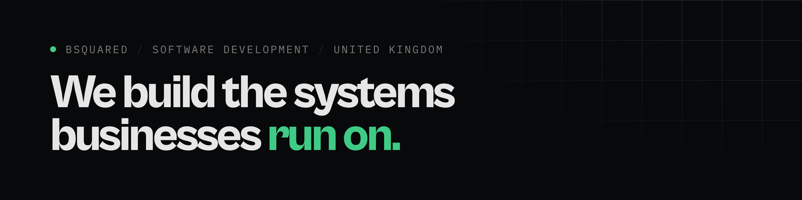

### We build the software UK businesses run on.

B Squared Software Development designs and builds line-of-business systems, internal tools, customer portals and the integrations that connect them. We work with businesses that have outgrown spreadsheets, or an off-the-shelf product that only does 80% of the job.

**How we work**

- **Fixed price, scoped in writing** before anything is built. Engagements start from £4,000.
- **One senior engineer, end to end.** The person who scopes the work writes it and deploys it. No account managers, no hand-offs.
- **Yours from day one.** Code, hosting, domains and accounts are in your name. Leaving is a decision, not a negotiation.
- **Proven technology**, deployed by pipeline, so any competent engineer can pick it up after us.

**Stack:** TypeScript · Next.js · NestJS · PostgreSQL · Redis · Docker · Swift

**Recent work**

- A practice-management and document platform for an accountancy firm, replacing a system it had outgrown.
- Eight applications on one platform for a construction and M&E group, from estimating to project management.
- [Curbed](https://bsquared.software/work/curbed), our own fleet-damage software, live with a taxi operator in the Netherlands.

**Why there's not much to see here:** client code lives in our clients' accounts, not ours. That's the point.

[bsquared.software](https://bsquared.software) · [Start a project](https://bsquared.software/contact) · [brandon@bsquared.software](mailto:brandon@bsquared.software) · [LinkedIn](https://www.linkedin.com/company/bsquared-software)

B Squared Software Development Ltd · Registered in England and Wales, no. 17262958
